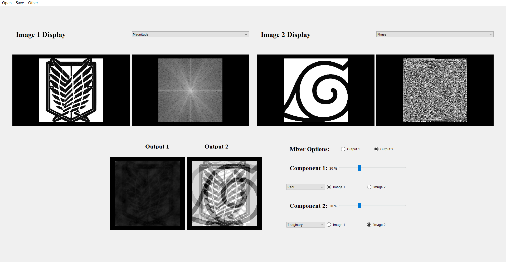
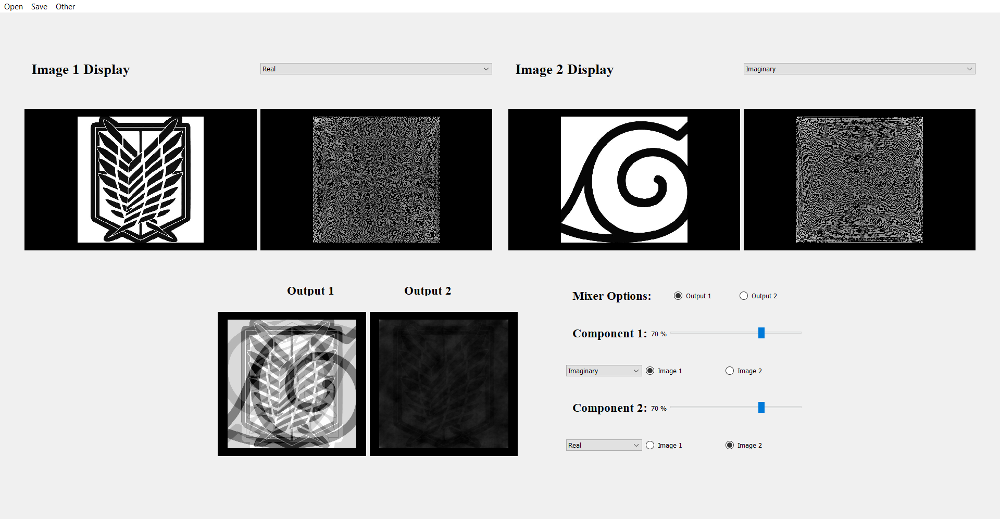

# Image Mixer

 My model is a simple simulation for an image mixer, where the main goal that it serves, that to show the main the importance of each of the data's components.
 Also to show the dominance of the phase component over the magnitude component in constructing the image  .
 Finally Allow the user to create a picture by mixing the components of previously selected images.

## Results

The program results are considered satisfying as it preserves the goal of showing the importance of each component and also abling the user to create different pictures by mixing the components of different images bu any ratio he finds suitable

