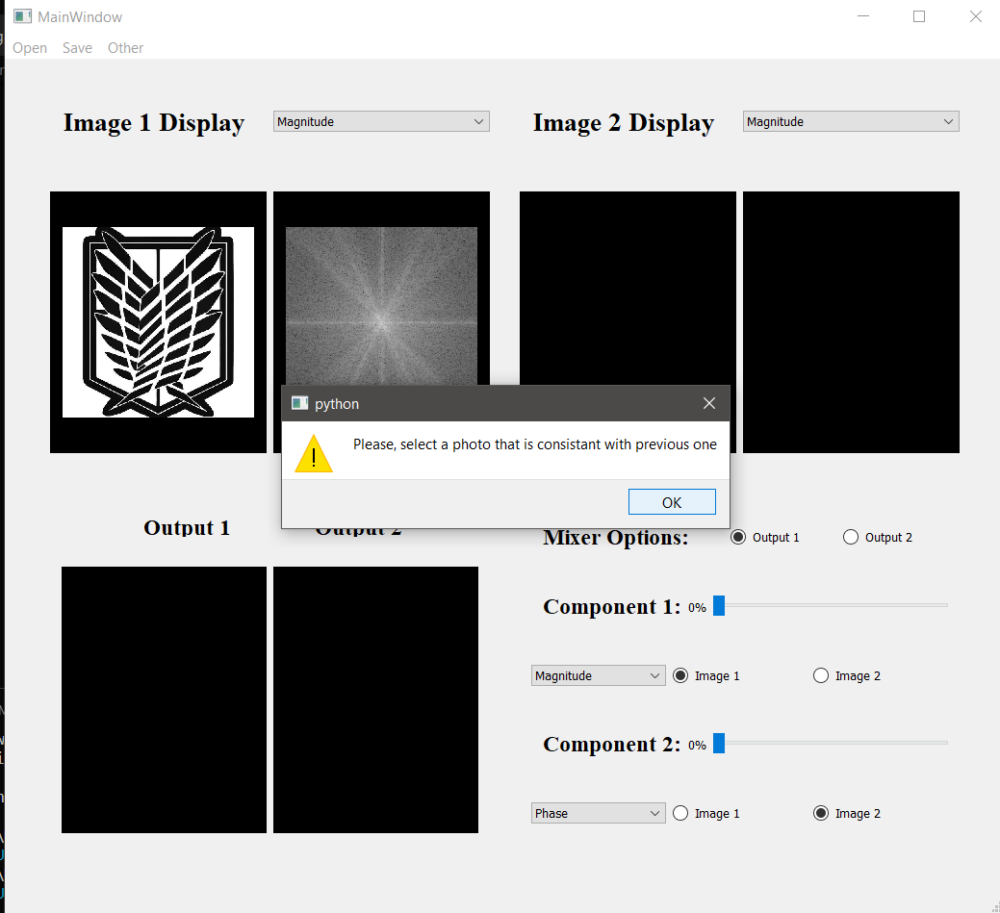
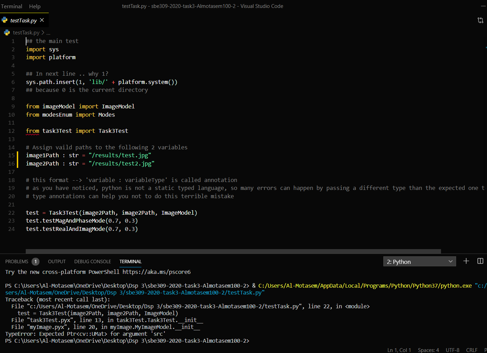

## Name: Mohammed Almotasem
### Sec: 2
### Bn: 18 

<!-- MarkdownTOC -->
- [Image Mixer](#image-mixer)
- [Files written:](#files-written)
- [Results:](#results)
    - [Screenshots to the program:](#screenshots-to-the-program)
    - [error messege:](#error-messege)
- [Logging file:](#logging-file)
- [Error in Test file:](#error-in-test-file)
<!-- MarkdownTOC -->
# Image Mixer
 My model is a simple simulation for an image mixer, where the main goal that it serves, that to show the main the importance of each of the data's components
 Also to show the dominance of the phase component over the magnitude component in constructing the image  
 Finally Allow the user to create a picture by mixing the components of previously selected images


# Files written:
* design.py : it contains the GUI design created by the Qt designer
* main.py : the file contains the program class, methods and attributes
* imagemodel.py : a file contains the image class

# Results:
The program results are considered satisfying as it preserves the goal of showing the importance of each component and also abling the user to create different pictures by mixing the components of different images bu any ratio he finds suitable

### Screenshots to the program:


### error messege:


# Logging file:
As instucted I used the logging library to help at tracking down the progress of the program


# Error in Test file:
When tried to run the the test file after implementing the Image model and providing the links of the two images required

The error:
```
 File "myImage.pyx", line 20, in myImage.MyImageModel.__init__
TypeError: Expected Ptr<cv::UMat> for argument 'src'
```
